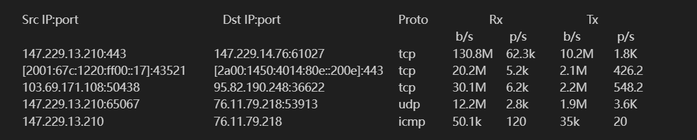

# ISA NetStat
Author: Adam Havlik - xhavli59

Date: 18.11.2024

## Program description

An application for obtaining network traffic statistics

Inspired by [iftop](https://pdw.ex-parrot.com/iftop/), native linux command line application to measure internet speed and transmitted payload

## Program dependencies

- Language C++, not using OOP
- Compiler g++
- Library libpcap
- Library ncurses

## Program execution

Application is reading a copy of packets running thru your network interfaces. On some machines, will need to be added permissions to run this app!

Makefile command `make` will compile `isa-top` executable file

Example of run command:

``` bash
./isa-top -i -eno1
```

### CLI arguments

| Name              | Argument | Default values | Possible values | Meaning or expected program behaviour
| ----------------- | -------- | -------------- | --------------- | -------------------------------------
| Interface         | `-i`     |                | `string`        | Specify network interface where to sniff 
| Sorting option    | `-s`     | `b`            | `b / p`         | Specify sorting option by bytes or packets
| Refresh rate      | `-t`     | `1`            | `seconds`       | Set refresh rate of statistics

If will be provided argument -i without its value, list of all avalilable interfaces will be shown

## Application output

App have two different outputs. One is standard output and second is for error messages

Output is in following format using ncurses library where:
- Src IP:port is source addres and its port. Can be IPv4 or IPv6 
- Dst IP:port is destination addres and its port. Can be IPv4 or IPv6 
- Proto is transport protocol on which the packet is sent. Can be tcp, udp or icmp
- Rx is received data. Values is shown as bytes or packets per second
- Tx is transmitted data. Values is shown as bytes or packets per second



## Implementation detail

### Program flow

### Code flow


## Testing

Tests were manually compared output of isa-top with Wireshark

## TODO
Supported protocols:
TCP, UDP, ICMP

Supported Interfaces:
Ethernet - Ethernet header...

## Known problems
- Application not correctly free all used memory at exit
- If only `-i` argument will be provided to see available devices, error message will be shown  

## Notes
- Developed with suport of ChatGPT and GithubCopilot
- Run Wireshark in dark mode as `sudo wireshark -style Adwaita-Dark` becouse user and root themes are not shared on my local machine.
  Running wireshark as sudo is not recommended due to wide scale of contrubutors and milion lines of code.
