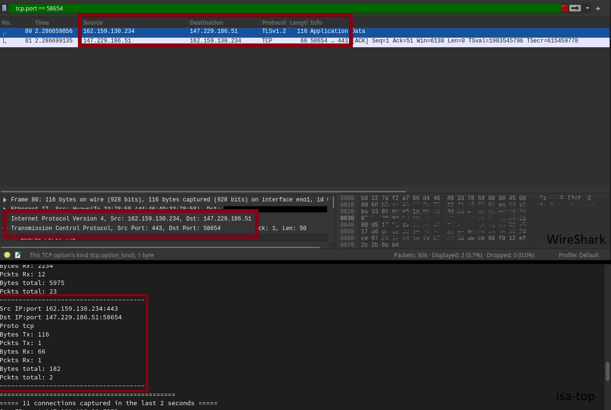
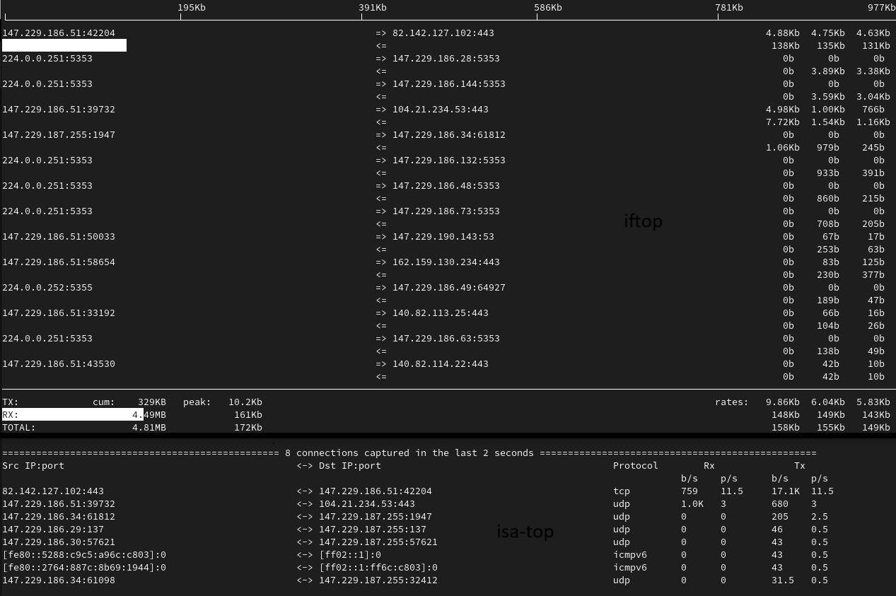

# ISA NetStat

Author: Adam Havlik - xhavli59 

Date: 18.11.2024 

## About

An application for obtaining network traffic statistics

Program is scanning only `tcp`, `udp`, `icmp` or `icmpv6` packets on specified network interface.
Supported network interfaces are `Ethernet` and `Wlan`. Then statistics will be displayed and updated by refresh time. How many statistics will be displayed depends on provided argument

Inspired by [iftop](https://pdw.ex-parrot.com/iftop/), native linux command line application to measure internet speed and transmitted payloads

GitHub repository [link](https://github.com/xhavli/ISA24_NetStat) to my solution

## Program dependencies

- Language C++
- Compiler g++
- Library libpcap
- Library ncurses
- License GPL-3.0

## Program execution

As application is reading a copy of packets running thru your network interfaces. On some machines, will need to be set permissions for run this app under sudo or admin!

Makefile command `make` will compile isa-top.cpp to a `isa-top` executable file

- Command example to display all awailable interfaces

``` bash
./isa-top -i eno1
```

- Runn command example with almost every possible arguments

``` bash
./isa-top -i eno1 -s p -t 2 -n 10
```

Sniff the eth0 interface, sort by packets, refresh every 2 seconds, and display the top 10 most comunicating connections

### CLI arguments

| Name              | Argument | Need       | Default values | Possible values | Meaning or expected program behaviour
| ----------------- | -------- | ---------- |--------------- | --------------- | ---------------------------------------------
| Interface         | `-i`     | required   |                | `string`        | Specify network interface where to sniff
| Sorting option    | `-s`     | optional   | `b`            | `b / p`         | Specify sorting option by bytes or packets
| Refresh rate      | `-t`     | optional   | `1`            | `uint_32`       | Set refresh rate of statistics
| Show connections  | `-n`     | optional   | `10`           | `uint_32`       | Number of connections which will be displayed
| Helper            | `-h`     | optional   |                | `h`             | Print help message and exit sucessfully

In case some of `optional` arguments will not be provided, "Warning" will be shown and default values will be set

### Man page

```bash
man ./isa-top.1
```

To display manual page locally

## Application output

Ncurses library is used to display statistics better and in real time with refresh rate provided by user

Errors, Warnings and other messages is printed to STDERR. Core of application is displayed to terminal using ncurses and will be lost after quit of application

Output meaning:

- **Src IP:port** is source addres and its port. Can be `IPv4` or `IPv6`
- **Dst IP:port** is destination addres and its port. Can be `IPv4` or `IPv6`
- **Protocol** is transport protocol on which the packet is sent. Can be `tcp`, `udp`, `icmp` or `icmpv6`
- **Rx** is received data. Values is shown as bytes or packets per second
- **Tx** is transmitted data. Values is shown as bytes or packets per second

```bash
Src IP:port                                         <-> Dst IP:port                                         Protocol        Rx              Tx
                                                                                                                        b/s    p/s      b/s    p/s
82.142.127.102:443                                  <-> 147.230.146.57:36340                                tcp         3.0M   46       68.4k  46
147.230.146.57:55943                                <-> 104.21.234.52:443                                   udp         2.1k   6        1.4k   7
[fe80::8e4b:65d4:446a:78f4]:60896                   <-> [ff02::c]:3702                                      udp         0      0        2.2k   3
147.230.146.34:64492                                <-> 147.230.187.255:1947                                udp         0      0        1.4k   17
140.82.114.26:443                                   <-> 147.230.146.57:43626                                tcp         96     1        158    2
[fe80::cd51:4265:e3ea:8725]:0                       <-> [ff02::1:ff4f:599e]:0                               icmpv6      0      0        86     1
```

### Output details

#### ICMP

As icmp is not using ports, it got default **value 0** as non reachable port number

#### Rx and Tx traffic

Connections is sorted descending by total **Rx+Tx** bytes or packets depends on provided sorting option

#### Bytes and Packets loads

When `-t` argument is set higher than 1, application will show loaded data devided by `-t` value and display unit per second. The result is rounded with precision of 1 decimal. Highest number which can be shown is 999.9. **When owerflow this value, number will be converted** to a higher unit.

Supported units and its suffixes:

- kilo - K
- Mega - M
- Giga - G
- Tera - T

Units are calculated with 1000 constant, not 1024 for better reading, not accuracy

## Implementation detail

Theres no object oriented programming (OOP) used in this application. Its written like plain C style

Program will handle `Ctrl+C` interrupt for smooth exit

Return codes:

- 0 if success
- 1 if any error

### Architecture

isa-top.cpp <- isa-printer.cpp <- isa-helper.cpp

### Program flow

- Arguments parsing
- Searching for available interfaces
- Select interface
- Open interface to read traffic
- Start printer thread
- Reading data from interface in infinite loop
- Exit on Ctrl+C

## Testing

As it is application which read real network traffic its hard to test that properly. One opinion is to deploy it on completely isolable machine and send some data. But i dont have time for this.

Tests were provided manually with comparing output of isa-top with Wireshark and iftop

### WireShark test

This test show if reading data is valid due to WireShark application

As we can see Rx or Tx load and packets are equal



### iftop test

This test show if output is simmilar due to iftop application

We can see some common interfaces based on IPv4 at top of both applications



## Known problems

- Application not correctly free all used memory at exit
- If only `-i` argument will be provided to see available devices, error message will be shown
- If is set long refresh rate and program recognize `Ctrl+C` interrupt, it will wait for long time to quit
- If will be pressed `Ctrl+C` more than one time when program is doing escape sequentions, segfault will appear.
  This is typical when user provide long refresh time, want to quit program and think about more interrupts will quit program forcefully and faster.
- Lot of global variables used in this project

## Notes

- Developed with suport of ChatGPT and GithubCopilot for better understanding a C++ syntax, not for direct solving core of the project
- Run Wireshark in dark mode as `sudo wireshark -style Adwaita-Dark` becouse user and root themes are not shared on my local machine.
  Running wireshark as sudo is not recommended due to wide scale of contrubutors and milion lines of code.
